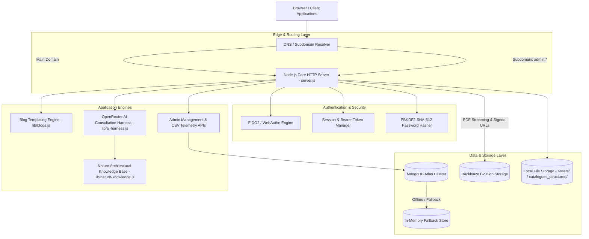
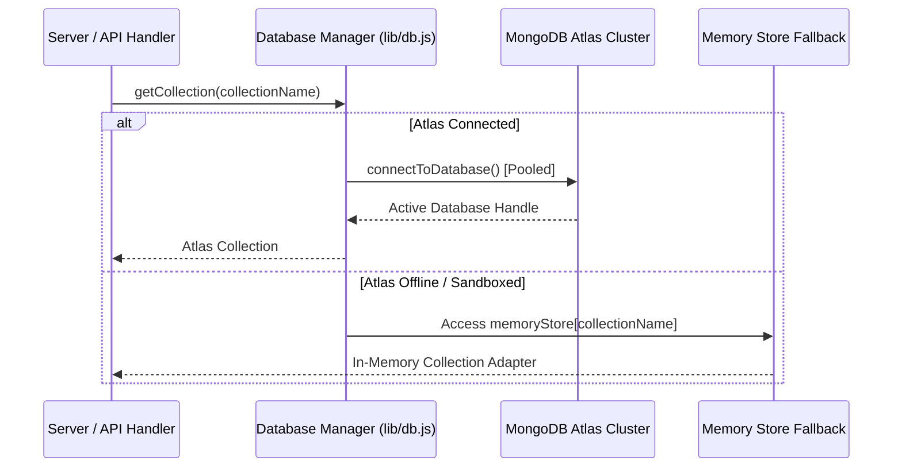
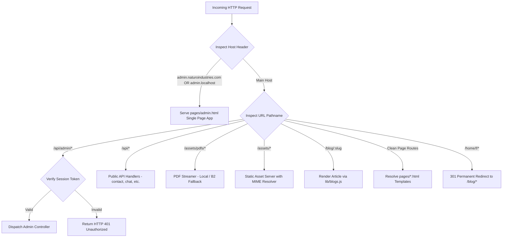
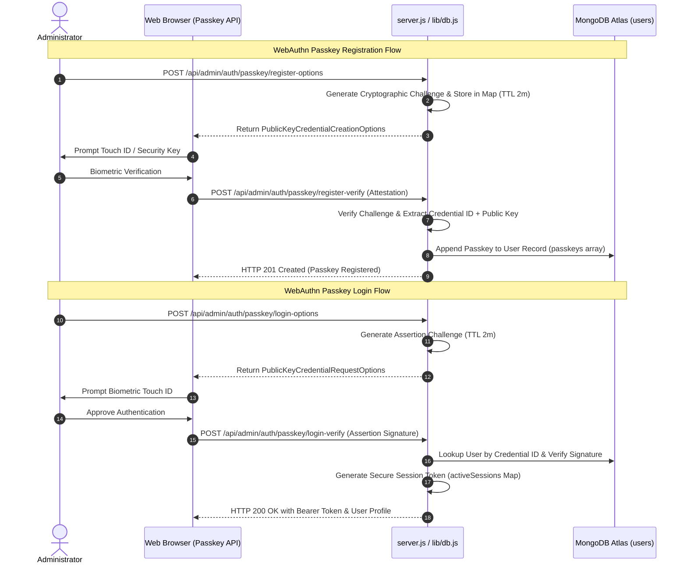
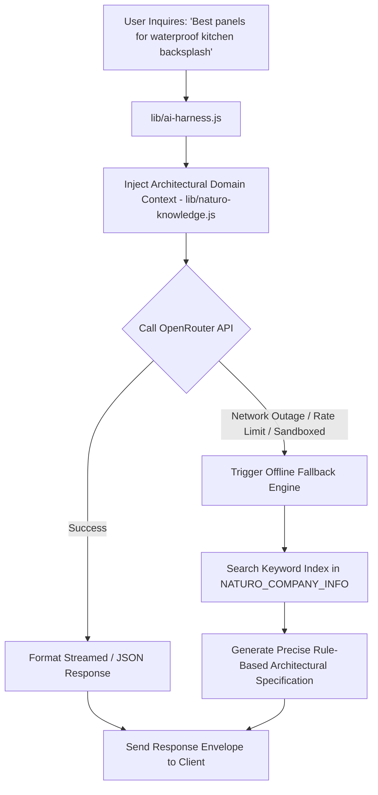

# Naturo Industries — System & Flow Architecture

## 1. Architectural Overview & System Topology

The **Naturo Industries Platform** is a high-performance, enterprise-grade web architecture designed for architectural surfaces, decorative panel manufacturing, certified plywood distribution, and automated product discovery.



---

## 2. Database Architecture & Data Models (`lib/db.js`)

The persistence tier utilizes **MongoDB Atlas** with connection pooling and a resilient in-memory fallback mechanism (`memoryStore`) that enables disconnected testing, mock environments, and uninterrupted uptime.

### 2.1 Connection Pool & Client Lifecycle
- **Connection Model**: Singleton `MongoClient` with active connection reuse.
- **Pool Sizing**: `minPoolSize: 2`, `maxPoolSize: 20`, `maxIdleTimeMS: 30000`.
- **Timeouts**: `connectTimeoutMS: 5000`, `serverSelectionTimeoutMS: 5000`.
- **Write Concern**: `w: 'majority'`, `retryWrites: true`.
- **Fault-Tolerance**: If `MONGODB_URI` is unreachable or unset, operations route seamlessly to `memoryStore` without throwing unhandled exceptions.



---

### 2.2 Collections & Schemas

#### A. Users & Administrators (`users`)
Stores administrative and editor credentials with PBKDF2 password hashing and FIDO2 WebAuthn passkey credentials.

| Field | Type | Description | Index |
| :--- | :--- | :--- | :--- |
| `_id` | `ObjectId` | Primary Key | Default |
| `username` | `String` | Unique login handle | `{ username: 1 }` (Unique, Sparse) |
| `email` | `String` | Contact & notification email | `{ email: 1 }` (Unique, Sparse) |
| `name` | `String` | Administrator display name | None |
| `company` | `String` | Corporate affiliation | None |
| `role` | `String` | Access role (`admin`, `editor`) | None |
| `passwordHash` | `String` | PBKDF2 SHA-512 salt:hash | None |
| `passkeys` | `Array<Object>` | Registered FIDO2 WebAuthn credentials | `{ 'passkeys.credentialId': 1 }` (Sparse) |
| `isActive` | `Boolean` | Account status | None |
| `createdAt` | `Date` | Record creation timestamp | None |
| `updatedAt` | `Date` | Last modification timestamp | None |

#### B. Passkey WebAuthn Challenges (`passkeyChallenges` Map)
In-memory challenge cache with 2-minute cryptographic expiration for biometric authentication.

```json
{
  "challenge": "base64url_random_32_bytes",
  "userId": "600000000000000000000001",
  "timestamp": 1756040000000
}
```

#### C. Contact Inquiries (`contacts`)
Inbound enterprise inquiries from the main contact page.

| Field | Type | Description | Index |
| :--- | :--- | :--- | :--- |
| `_id` | `ObjectId` | Primary Key | Default |
| `name` | `String` | Customer / Architect name | None |
| `email` | `String` | Customer email | `{ email: 1 }` |
| `phone` | `String` | Phone number | None |
| `subject` | `String` | Inquired product / topic | None |
| `message` | `String` | Inquiry text content | None |
| `status` | `String` | Processing status (`pending`, `reviewed`, `contacted`) | `{ status: 1 }` |
| `createdAt` | `Date` | Timestamp | `{ createdAt: -1 }` |

#### D. Product Sample Requests & Quotes (`inquiries`)
Architectural sample and direct quotation requests.

| Field | Type | Description | Index |
| :--- | :--- | :--- | :--- |
| `_id` | `ObjectId` | Primary Key | Default |
| `name` | `String` | Requester name | None |
| `email` | `String` | Requester email | `{ email: 1 }` |
| `phone` | `String` | Phone number | None |
| `productSlug`| `String` | Referenced product code / catalog | None |
| `projectType`| `String` | Project type (Residential, Commercial, Hospitality) | None |
| `status` | `String` | Status | None |
| `createdAt` | `Date` | Timestamp | `{ createdAt: -1 }` |

#### E. Job Applications (`applications`)
Talent acquisition and career submissions.

| Field | Type | Description | Index |
| :--- | :--- | :--- | :--- |
| `_id` | `ObjectId` | Primary Key | Default |
| `name` | `String` | Candidate name | None |
| `email` | `String` | Candidate email | `{ email: 1 }` |
| `position` | `String` | Target role (Sales, Engineering, Design) | `{ position: 1 }` |
| `experience`| `String` | Years of experience | None |
| `resumeUrl` | `String` | Link or storage path to CV | None |
| `createdAt` | `Date` | Submission timestamp | `{ createdAt: -1 }` |

#### F. Newsletter Subscribers (`newsletter_subscribers`)
Email subscription registry.

| Field | Type | Description | Index |
| :--- | :--- | :--- | :--- |
| `_id` | `ObjectId` | Primary Key | Default |
| `email` | `String` | Subscriber email address | `{ email: 1 }` (Unique) |
| `source` | `String` | Acquisition point (Footer, Popup, Blog) | None |
| `isActive` | `Boolean` | Subscription state | None |
| `createdAt` | `Date` | Timestamp | None |

#### G. Product Catalog Entities (`products`)
Structured product inventory.

| Field | Type | Description | Index |
| :--- | :--- | :--- | :--- |
| `_id` | `ObjectId` | Primary Key | Default |
| `name` | `String` | Product title | None |
| `slug` | `String` | URL-safe slug | `{ slug: 1 }` (Unique, Sparse) |
| `category` | `String` | Product family (Plywood, Louvers, Surfaces, Stone) | `{ category: 1 }` |
| `description` | `String` | Product specifications | None |
| `thickness` | `Array<String>` | Available thicknesses (e.g., `["6mm", "12mm"]`) | None |
| `inStock` | `Boolean` | Availability flag | None |
| `order` | `Number` | Display order weight | None |

#### H. Editorial Blog Articles (`blogs`)
Published and draft architectural articles.

| Field | Type | Description | Index |
| :--- | :--- | :--- | :--- |
| `_id` | `ObjectId` | Primary Key | Default |
| `slug` | `String` | Article slug identifier | `{ slug: 1 }` (Unique, Sparse) |
| `title` | `String` | Full headline | None |
| `category` | `String` | Editorial taxonomy | `{ category: 1 }` |
| `contentHtml`| `String` | Pre-rendered semantic HTML body | None |
| `image` | `String` | Local asset path (`assets/images/blog/...`) | None |
| `ogImage` | `String` | Absolute Open Graph image URL | None |
| `published` | `Boolean` | Visibility flag | None |
| `createdAt` | `Date` | Publication timestamp | `{ createdAt: -1 }` |

---

## 3. Storage & Binary Asset Architecture (`lib/blob-storage.js`)

Naturo Industries utilizes a hybrid storage architecture:
1. **Backblaze B2 Private Blob Storage**: Hosts full-resolution, multi-megabyte PDF catalogues.
2. **Local Optimized Cache (`assets/` & `catalogues_structured/`)**: Houses pre-extracted WebP/JPEG/PNG imagery, local static PDFs, stylesheets, and fonts.

```mermaid
graph LR
    User[User / Browser] -->|Requests /assets/pdfs/:file| Server[server.js]
    Server -->|1. Check Local assets/pdfs/| Local[Local File System]
    Local -->|Found| StreamLocal[Stream Local File (HTTP 200)]
    Local -->|Missing| B2Auth[Authorize B2 (lib/blob-storage.js)]
    B2Auth -->|2. Stream via B2 API| B2Bucket[(Backblaze B2 naturo-surface-pdfs)]
    B2Bucket --> StreamRemote[Stream B2 Content with Cache-Control]
```

### 3.1 Backblaze B2 Blob Client Implementation
- **Authentication**: `b2_authorize_account` caching tokens with 20-hour TTL (`AUTH_CACHE_TTL_MS = 20 * 60 * 60 * 1000`).
- **Concurrent Uploads**: `scripts/sync-catalogues-to-b2.js` and `scripts/upload-pdfs.js` implement worker pools with configurable concurrency (default: 4 workers).
- **HTTP Caching**: Remote streams set `Cache-Control: public, max-age=86400, s-maxage=604800`.
- **Signed Download URLs**: `getSignedDownloadUrl()` issues temporary expiring tokens via `b2_get_download_authorization`.

---

## 4. Server Routing & Request Lifecycle (`server.js`)

The Node.js server provides native routing, security middleware, and subdomain dispatching without heavy runtime frameworks:



### 4.1 Security Middleware & Headers
Every outgoing HTTP response is wrapped with enterprise security headers:
- `X-Content-Type-Options: nosniff`
- `X-Frame-Options: SAMEORIGIN`
- `X-XSS-Protection: 1; mode=block`
- `Referrer-Policy: strict-origin-when-cross-origin`
- `Strict-Transport-Security: max-age=31536000; includeSubDomains` (Production HTTPS)
- `Content-Security-Policy`: Restricts scripts, styles, and font origins while permitting WebAuthn and Backblaze connections.
- **Path Traversal Protection**: `resolveFilePath()` resolves normalized absolute paths against `__dirname` and prevents `..` escape attacks.

---

## 5. Authentication & WebAuthn Passkey Flow

The platform supports dual-mode admin authentication:
1. **PBKDF2 Encrypted Password Credentials**
2. **FIDO2 / WebAuthn Hardware Passkeys** (Touch ID, Face ID, Windows Hello, YubiKey)



---

## 6. AI Consultation Engine & Fallback Pipeline (`lib/ai-harness.js`)

Naturo provides automated architectural recommendations and surface specification matching through an intelligent multi-tiered AI pipeline:



---

## 7. Build Engine & Static Site Generation (`build.js` & `lib/blogs.js`)

To guarantee SEO rankings, instant load times, and Core Web Vitals performance:
- `lib/blogs.js` acts as the **single source of truth** for all architectural articles, schema metadata, and HTML templates.
- `build.js` reads `DEFAULT_BLOGS`, compiles semantic HTML files, embeds JSON-LD schema graphs (`BlogPosting`, `Organization`), and publishes static artifacts into:
  - `blog/<slug>.html`
  - `dist/blog/<slug>.html`
  - `dist/assets/`

---

## 8. Directory Structure Reference

```text
naturoindustries.com/
├── .agents/
│   └── AGENTS.md                  <-- Engineering guidelines & Strict No-Emoji policy
├── api/                           <-- Serverless endpoint adapters
├── assets/
│   ├── css/                       <-- Global styles & typography
│   ├── fonts/                     <-- Self-hosted WOFF2 webfonts
│   ├── icons/                     <-- SVG icons & Apple touch icons
│   ├── images/
│   │   └── blog/                  <-- Real product photos extracted from PDF catalogues
│   ├── js/                        <-- Frontend scripts (naturo-interactive.js)
│   └── pdfs/                      <-- Local active PDF catalogues (33 files)
├── blog/                          <-- Pre-rendered static blog HTML pages
├── catalogues_structured/         <-- 75 standardized PDF catalogues across 8 categories
├── catalogues_unzipped/           <-- Pristine raw source catalogue archive (1.01 GB)
├── dist/                          <-- Production build distribution output
├── lib/
│   ├── ai-harness.js              <-- OpenRouter AI engine with offline fallback
│   ├── blob-storage.js            <-- Backblaze B2 private blob storage client
│   ├── blogs.js                   <-- Blog single source of truth & HTML renderer
│   ├── db.js                      <-- MongoDB Atlas pool, models & WebAuthn manager
│   └── naturo-knowledge.js        <-- Comprehensive domain knowledge base
├── pages/                         <-- Canonical source HTML pages
│   ├── index.html                 <-- Homepage
│   ├── about.html                 <-- About Us
│   ├── products.html              <-- Product search & catalog viewer
│   ├── admin.html                 <-- Multi-tenant WebAuthn Admin Console SPA
│   ├── careers.html               <-- Job openings & application portal
│   ├── contact.html               <-- Enterprise inquiry form
│   ├── visit.html                 <-- Showroom & Experience Center locator
│   ├── naturo-ply.html            <-- IS:710 Marine Grade Plywood showcase
│   ├── privacy-policy.html        <-- Legal privacy policy
│   └── terms-and-conditions.html  <-- Terms of service
├── scripts/
│   ├── download-assets.js         <-- Asset synchronization utility
│   ├── sync-catalogues-to-b2.js   <-- Structured catalogue B2 synchronizer
│   └── upload-pdfs.js             <-- Legacy concurrent PDF uploader
├── test/
│   ├── verify.js                  <-- Core site & routing verification test suite
│   └── verify-admin.js            <-- Admin console & passkey verification suite
├── build.js                       <-- Static blog generator & distribution builder
├── server.js                      <-- Core HTTP server & API dispatcher
└── package.json                   <-- Project metadata, dependencies & scripts
```
