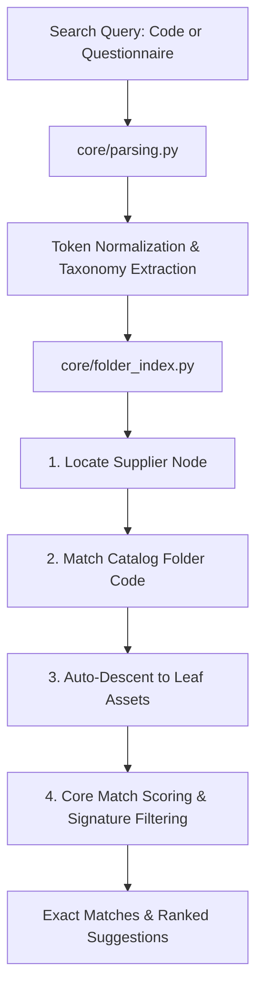

# Naturo Surfaces — Product & Catalog Naming Standards

## 1. Executive Summary & Purpose

The **Naturo Product Search Engine** indexes and searches thousands of decorative surface products, catalogs (PDFs), and high-resolution item photos across multiple suppliers and material categories (Charcoal, PVC, WPC, UV Marble sheets, Acrylic, etc.).

To ensure deterministic parsing, fast automated indexing, and high search accuracy across both the desktop (PySide6) and web interfaces, product identifiers, PDF catalogs, folders, and image files adhere to a structured naming grammar.

---

## 2. Product Code Anatomy & Grammar

A complete Naturo product code or filename is composed of ordered semantic tokens separated by spaces or underscores (`_`):

```text
[ITEM_CODE] [MATERIAL] [DESIGN_PATTERN] [SURFACE_FINISH] [DIMENSIONS] [SUPPLIER_CODE] [MRP_TAG]
```

### Standard Token Sequence:
1. **Item / Design Code (`file_token` / `prefix`)**: Unique design number or model identifier (e.g., `IN 5017`, `ML 9061`, `L105`, `3012`, `DT 6001`).
2. **Material Code**: 2 to 4-character material abbreviation (e.g., `PV`, `CH`, `WP`, `UVMB`).
3. **Design Pattern**: Geometry and profile code (e.g., `FT`, `Eq9L`, `4S7L`, `3S14L`, `RD`, `LV`).
4. **Surface Finish**: Texture and coating code (e.g., `TX`, `MTT`, `SL`, `PR`, `WD`, `GL`).
5. **Dimensions / Size**: Width in inches or mm and height in feet (e.g., `12"10F`, `5"9.5F`, `8F4F`, `17MM 6.5"9.5F`).
6. **Supplier / Series Identifier**: 4-letter supplier code or series tag (e.g., `RYPP`, `AYR`, `MHPP`).
7. **MRP / Price Tag (Optional)**: Retail price flag stripped during core matching (e.g., `MRP2500`, `MRP 1800`).

### Practical Product Code Examples:
- `IN 5017 PV FT Tx9L 12"10F AYR`
  - Item Code: `IN 5017`
  - Material: `PV` (PVC)
  - Design/Pattern: `FT` (Fluted), `Tx` (Texture), `9L` (9 Lines)
  - Dimensions: `12"10F` (12 inches wide × 10 feet high)
  - Series/Supplier: `AYR`
- `ML 9061 PV FT MT4S7L 12"10F AYR`
  - Item Code: `ML 9061`
  - Material: `PV` (PVC)
  - Design: `FT` (Fluted), `MT` (Matt), `4S7L` (4 Steps, 7 Lines)
  - Dimensions: `12"10F` (12" × 10')
- `CH 12C 12"9.5F`
  - Material: `CH` (Charcoal)
  - Series/Design: `12C`
  - Dimensions: `12"9.5F` (12 inches × 9.5 feet)
- `WP 23MM 6.5"9.5F`
  - Material: `WP` (WPC)
  - Thickness: `23MM`
  - Dimensions: `6.5"9.5F` (6.5 inches × 9.5 feet)

---

## 3. Standard Code Dictionaries & Taxonomy

### 3.1 Material Codes (`MATERIAL_MAP`)

| Material Name | Code | Description |
| :--- | :---: | :--- |
| **Charcoal** | `CH` | Charcoal highlighter panels |
| **PVC** | `PV` | Polyvinyl chloride fluted and flat panels |
| **WPC** | `WP` | Wood-plastic composite exterior/interior louvers |
| **Super Heavy** | `SPHV` | High-density reinforced panels |
| **Ultra Voilet Foarm Sheet** | `UVFS` | UV-coated lightweight foam sheets |
| **Ultra Voilet Marble Sheet**| `UVMB`| UV-coated faux marble composite sheets |
| **Tiger Fabric** | `TG` | Textured fabric acoustic/decorative highlighters |
| **Acrylic** | `ACY` | High-gloss and matte acrylic laminates & panels |

---

### 3.2 Color Codes (`COLOR_MAP`)

| Color Name | Code | Color Name | Code |
| :--- | :---: | :--- | :---: |
| **Red** | `RD` | **Brown** | `BR` |
| **Black** | `BL` | **White** | `WT` |
| **Gold** | `GD` | **Purple** | `PL` |
| **Silver** | `SV` | **Green** | `GN` |
| **Teak** | `TK` | **Rose Gold** | `RG` |
| **Walnut** | `WL` | **Beige** | `BG` |
| **Yellow** | `YL` | **Cream** | `CR` |
| **Blue** | `BU` | **Mauve / Mobe** | `MO` |
| **Steel** | `ST` | **Metallic** | `MT` |
| **Grey** | `GY` | **Marble** | `MB` |

---

### 3.3 Design & Pattern Categories (`DESIGN_CATEGORIES`)

#### A. Pattern Types
- `FT` — **Fluted** (Grooved louver panels)
- `EQ` / `Eq<N>L` — **Equal Distance Between Lines** (e.g., `Eq4L`, `Eq7L`, `Eq9L`)
- `L` / `<N>L` — **Line Count** (e.g., `10L`, `14L`)
- `S` / `<N>S<M>L` — **Step Pattern** (e.g., `4S7L` = 4 Steps with 7 Lines, `3S14L` = 3 Steps with 14 Lines)
- `DT` — **Double Tone** (Dual-shade color finish)
- `RD` — **Rounded** (Curved fluting)
- `LV` — **Louver Style**

#### B. Surface Finishes
- `TX` / `Tx` — **Texture** (Embossed surface)
- `MTT` / `MT` — **Matt** (Non-reflective finish)
- `SL` — **Seamless** (Interlocking seamless joint profile)
- `PR` — **Printed** (Digital printed design)
- `WD` — **Wooden** (Natural wood grain finish)

#### C. Special Types
- `DMS` — **Digital Marble Sheet**
- `FMS` — **Fluted Marble Sheet**
- `BMDM` — **Book Match Digital Marble** (Symmetrical continuous marble grain)
- `DMGL` — **Digital Marble Gold Line**
- `H3D` — **High / 3D Sheet**
- `PL` — **Panel No Line** (Flat face sheet)
- `VO` — **Volume** (Multi-volume collection indicator)
- `CT` — **Catalogue**

---

### 3.4 Supplier Codes (`SUPPLIER_CODES`)

4-letter capital acronyms representing authorized manufacturers and suppliers:

| Supplier Code | Meaning / Sample Identifier |
| :---: | :--- |
| `RYPP` | Ryan, Patna |
| `WFKD` | WonderFloor, Kirti Nagar, Delhi |
| `JAWD` | JAWD Supplier Partner |
| `MHPP` | MHPP Supplier Partner |
| `GSPD` | GSPD Supplier Partner |
| `MPKD` | MPKD Supplier Partner |
| `NXSP` | NXSP Supplier Partner |
| `LPSM` | LPSM Supplier Partner |
| `DSSP` | DSSP Supplier Partner |
| `JGSP` | JGSP Supplier Partner |
| `ETNU` | ETNU Supplier Partner |
| `HEHH` | HEHH Supplier Partner |
| `SWSP` | SWSP Supplier Partner |
| `KYKN` | KYKN Supplier Partner |
| `KKGH` | KKGH Supplier Partner |
| `OJLD` | OJLD Supplier Partner |
| `RKGD` | RKGD Supplier Partner |
| `LVGU` | LVGU Supplier Partner |
| `MUNU` | MUNU Supplier Partner |
| `SSSG` | SSSG Supplier Partner |
| `LDZP` | LDZP Supplier Partner |
| `STSG` | STSG Supplier Partner |
| `DERG` | DERG Supplier Partner |
| `SSSD` | SSSD Supplier Partner |
| `KYGH` | KYGH Supplier Partner |
| `REPP` | REPP Supplier Partner |
| `HCIM` | HCIM Supplier Partner |

---

### 3.5 Dimensions & Size Notation

1. **Width Notation**:
   - Double quotes for inches: `5"`, `6.5"`, `10"`, `12"`
   - Metric thickness / width: `17MM`, `23MM`, `1.5MM`, `2MM`
2. **Height Notation**:
   - Letter `F` suffix for feet: `8F`, `9F`, `9.5F`, `10F`
3. **Combined Dimensions**:
   - Sheet format: `8F4F` (8 ft × 4 ft)
   - Panel format: `12"10F` (12 in × 10 ft), `5"9.5F` (5 in × 9.5 ft)

---

## 4. Directory & PDF Catalog Hierarchy Standards

To facilitate auto-indexing and fast traversal, catalog folders follow a strict hierarchical structure:

```text
[ROOT_DIRECTORY] (e.g., 1.Highlighter Folders/)
├── <SUPPLIER_CODE>_I_<SupplierName>, <City>/
│   ├── Rate Lists / Pricelists (e.g., "Ryan Rate List")
│   ├── Catalogs & Full PDFs (e.g., "Ryan PDF/")
│   └── Selected, Item Photo/                      <-- Primary indexed photo root
│       ├── <FOLDER_INDEX>_<CATALOG_NAME>.PDF/    <-- Folder Code / Catalog subfolder
│       │   ├── <MATERIAL> <DIMENSIONS>/          <-- e.g. "PV FT 12\"10F"
│       │   │   ├── <SPECIFIC_PROFILE_SERIES>/    <-- e.g. "PV FT Eq9L 12\"10F AYR"
│       │   │   │   ├── <ITEM_CODE> <ATTRIBUTES>.<EXT>
│       │   │   │   └── ...
```

### Folder Level Specifications:

| Level | Naming Convention | Example |
| :--- | :--- | :--- |
| **Level 1: Supplier** | `<SUPPLIER_CODE>_I_<Name>, <City>` | `RYPP_I_Ryan, Pathna` |
| **Level 2: Item Photos** | `Selected, Item Photo` | `Selected, Item Photo` |
| **Level 3: Catalog/Folder Code** | `<NUM>_<CATALOG_NAME>[.PDF]` | `2_ALL FLUTED PANELL.PDF`, `6_Flutted UV`, `12_Ryan PVC PDF 29-01-2025` |
| **Level 4: Material & Size** | `<MATERIAL> [<DESIGN>] <SIZE>` | `PV FT 12"10F`, `CH 12"9.5F`, `WP 23MM 6.5"9.5F`, `UVMB 8F4F` |
| **Level 5: Profile Variation** | `<MATERIAL> <DESIGN> <PATTERN> <SIZE> [<TAG>]` | `PV FT Eq9L 12"10F AYR`, `PV FT 4S7L 12"10F AYR`, `CH 12A 12"9.5F` |
| **Level 6: Asset Filename** | `<ITEM_CODE> <FULL_ATTRIBUTES>.<EXT>` | `IN 5017_PV FT Tx9L 12"10F AYR.jpg`, `ML 9061 PV FT MT4S7L 12"10F AYR.png` |

---

## 5. Search Engine Mechanics & Parser Architecture

The search engine (`core/folder_index.py`, `core/parsing.py`, `core/matching.py`) operates through a multi-stage indexing and matching pipeline:



### 5.1 Tokenization & Normalization
- Converts input to lowercase alphanumeric tokens, treating non-alphanumerics (`-`, `/`, `\`, `_`, `.`, `"`) as token boundaries.
- Normalizes inch and feet symbols (`12"`, `12in`, `12_`, `10F`, `9.5F`).
- Filters out non-searchable pricing strings (e.g., `MRP 2500` or `MRP2500`).

### 5.2 Auto-Descent Traversal
- **Supplier Scoring**: High score boost (+3 for matching supplier code, +4 for folders containing `selected`, +1 for `item`).
- **Folder Code Match**: Identifies indexed prefix (e.g., query `2` matches folder `2_ALL FLUTED PANELL.PDF`).
- **Single-Child Descent**: Recursively descends until leaf files (images/PDFs) or a multi-path branching point is encountered.

### 5.3 Match Scoring Matrix

| Attribute Match | Weight | Condition |
| :--- | :---: | :--- |
| **Material Match** | `+3` | Material code (`pv`, `ch`, `wp`, `uvmb`, etc.) matches path/filename |
| **Color Match** | `+3` | Color code (`bl`, `rd`, `gd`, `sv`, `tk`, etc.) matches path/filename |
| **Size / Dimension Match** | `+3` | Size variant matches (`12"10f`, `12_10f`, `1210f`, `8f4f`, etc.) |
| **Design / Pattern Match** | `+2` | Design code (`ft`, `mtt`, `tx`, `eq`, `4s7l`, etc.) matches |
| **File / Item Token Match**| `+3` | Exact item code token (e.g., `5017`, `9061`, `l105`) matches |

### 5.4 Alphanumeric Series Signature Match
- Extracts all alphanumeric characters into a compact signature string (and its reverse).
- If a file path directly contains the alphanumeric signature (e.g., `in5017` in `IN 5017_PV...`), it qualifies immediately as an exact signature match.

---

## 6. Supported File Extensions

The search engine indexes both image and PDF catalog assets:
- **Images**: `.jpg`, `.jpeg`, `.png`, `.webp`, `.bmp`, `.tif`, `.tiff`, `.heic`, `.jfif`
- **Documents**: `.pdf`
- **Extensionless Files**: Indexed if present in the catalog folder.

---

## 7. Quality Checklist for New Catalogs & Files

When adding new suppliers, catalog PDFs, or extracted photos:

- [ ] **Supplier Folder**: Prefix with 4-letter uppercase supplier code (e.g., `ETNU_I_Etna, Delhi`).
- [ ] **Catalog Folder**: Prefix with index number and clear descriptor (e.g., `14_Charcoal_Panels_2026.PDF`).
- [ ] **Folder Sizing**: Use consistent inch (`"`) and feet (`F`) symbols (e.g., `PV 12"10F`).
- [ ] **Material Codes**: Use standard codes from `MATERIAL_MAP` (`CH`, `PV`, `WP`, `UVFS`, `UVMB`, `TG`, `ACY`).
- [ ] **Design/Pattern Codes**: Use standardized codes (`FT`, `MTT`, `TX`, `Eq<N>L`, `<N>S<M>L`, `BMDM`, `DMS`).
- [ ] **Item Photo Names**: Begin with the unique design/shade number (e.g., `IN 2048 PV FT Eq9L 12"10F AYR.jpg`).
- [ ] **Exclude Unwanted Characters**: Avoid zero-width spaces (`\u200b`), non-breaking spaces, and hidden system files (`.DS_Store`).
